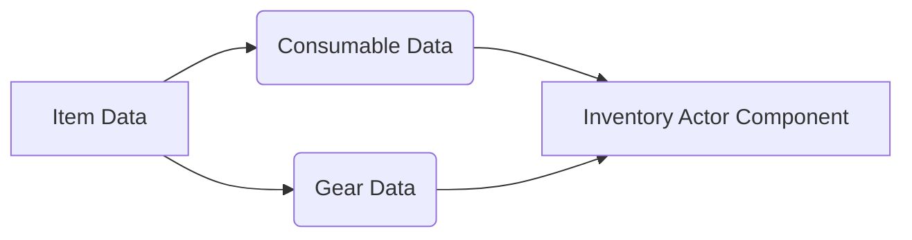

# Item Management plugin

plugin wrote in context of Unreal Engine 5.5

### This plugin depends on Gameplay Ability System

### basic flow in graph:

```mermaid
graph LR
A[Item Data] --> B(Consumable Data)
A --> C(Gear Data)
B --> D[Inventory Actor Component]
C --> D
```